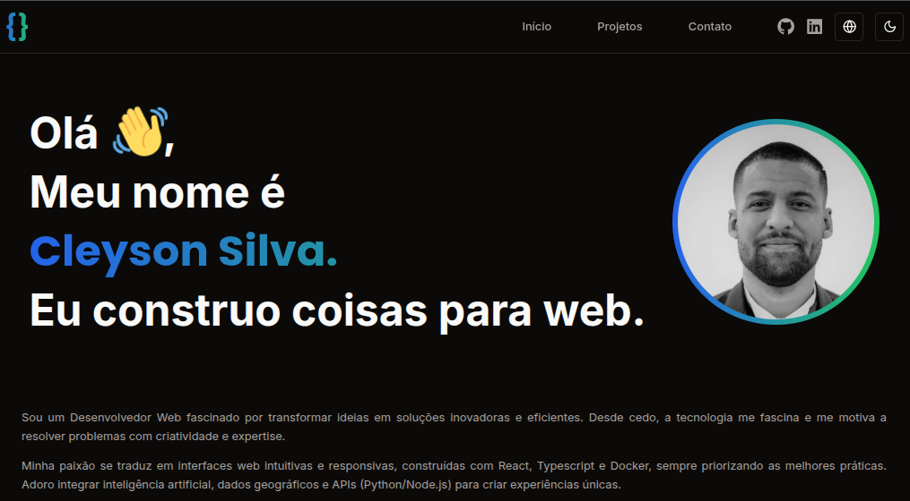

<h1 align="center">
  Cleyson Silva - Portfolio
</h1>

<p align="center">
  <a href="#-tecnologias">Tecnologias</a>&nbsp;&nbsp;&nbsp;|&nbsp;&nbsp;&nbsp;
  <a href="#-projeto">Projeto</a>&nbsp;&nbsp;&nbsp;|&nbsp;&nbsp;&nbsp;
  <a href="#-funcionalidades">Funcionalidades</a>&nbsp;&nbsp;&nbsp;|&nbsp;&nbsp;&nbsp;
  <a href="#memo-licenca">Licença</a>
</p>

<p align="center">
  <a href="https://github.com/cleysonsilvame/me/commits/main">
    
  </a>

  <a href="https://github.com/cleysonsilvame/me/issues">
    
  </a>

  
</p>

<p float="center">
  
</p>

## 🚀 Tecnologias

Este projeto foi desenvolvido com as seguintes tecnologias:

- **Next.js 15** - Framework React com App Router
- **TypeScript** - Tipagem estática
- **Tailwind CSS** - Framework CSS utilitário
- **Framer Motion** - Animações
- **Next-intl** - Internacionalização (i18n)
- **Next-themes** - Gerenciamento de temas (dark/light)
- **Radix UI** - Componentes acessíveis
- **Lucide React** - Ícones
- **React Icons** - Biblioteca de ícones

## 💻 Projeto

Este é o portfólio pessoal do Cleyson Silva, um desenvolvedor web apaixonado por transformar ideias em soluções inovadoras e eficientes. O projeto apresenta uma interface moderna e responsiva com suporte a múltiplos idiomas (Português e Inglês) e temas claro/escuro.

### Sobre o Desenvolvedor

Cleyson é um desenvolvedor web que se destaca por:
- Desenvolver interfaces web intuitivas e responsivas
- Utilizar React, TypeScript e Docker com melhores práticas
- Integrar inteligência artificial, dados geográficos e APIs
- Aplicar testes automatizados e princípios SOLID
- Contribuir ativamente para o sucesso da equipe

## ✨ Funcionalidades

- **Design Responsivo** - Interface adaptável para diferentes dispositivos
- **Tema Escuro/Claro** - Alternância entre modos de visualização
- **Internacionalização** - Suporte para Português e Inglês
- **Animações Suaves** - Transições e animações com Framer Motion
- **Seções Principais**:
  - Hero com apresentação pessoal
  - Sobre mim com informações detalhadas
  - Stack tecnológico
  - Portfólio de projetos
  - Página de contato

## 🛠️ Como executar

```bash
# Clone o repositório
git clone https://github.com/cleysonsilvame/me.git

# Entre no diretório
cd me

# Instale as dependências
npm install

# Execute o projeto
npm run dev
```

Acesse [http://localhost:3000](http://localhost:3000) para visualizar o projeto.

## :memo: Licença

Veja o arquivo [LICENSE](LICENSE) para mais detalhes.

### Autor

---

<a href="https://github.com/cleysonsilvame/" title="Cleyson Silva">
 
 <br />

<sub><b>Cleyson Silva</b></sub> 🚀</a>

👋🏽 Entre em contato!

[](https://www.linkedin.com/in/cleyson-silva-639b01188/) [](mailto:cleysonsilva.me@gmail.com)
